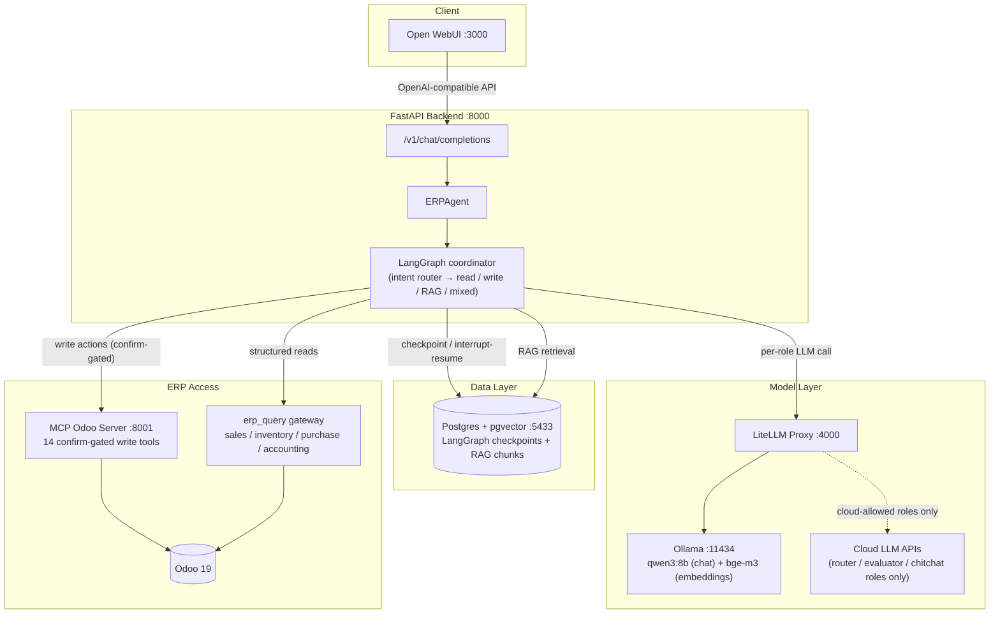

# ERP AI Assistant

A conversational AI assistant for Odoo 19 — creates and edits sales/purchase
orders, answers inventory and pricing questions, and grounds policy/SOP
questions in a document RAG store. Runs entirely through
[Open WebUI](https://github.com/open-webui/open-webui) as an OpenAI-compatible
chat backend; every write action is confirmed by the user before it touches
Odoo.

## Why this exists

Most "ERP + LLM" demos stop at read-only Q&A. This project's actual goal is
the harder half: letting the assistant **write** to a live ERP (create a
quotation, adjust stock, post an invoice) without becoming a liability — every
write is gated behind an explicit user confirmation, every business-data-bearing
model call is pinned to a local LLM by construction (not by convention), and
every tool the agent can call is allowlisted at the MCP layer.

## Architecture



**Request flow.** Open WebUI talks to the backend as if it were any other
OpenAI-compatible model. The backend derives a stable per-conversation thread
id (from Open WebUI's own chat-id headers when present) and hands the message
history to a LangGraph coordinator. An intent router classifies the turn into
one of five branches: **read** (structured ERP lookups), **write** (order
creation/edits/inventory adjustments — always confirm-gated), **RAG**
(policy/SOP/document questions), **mixed** (needs both), or **chitchat**. Write
flows use LangGraph's interrupt/resume mechanism: the graph pauses, asks the
user to confirm, and only resumes toward Odoo once the reply is classified as
an unambiguous yes.

**Two separate paths into Odoo, by design.** Actions (create/confirm/adjust)
go through a small, explicit MCP tool surface — 14 tools, each mapped to one
Odoo operation, deny-by-default for anything not on the map. Reads go through
`erp_query`, a bounded-context query gateway (sales/inventory/purchase/
accounting) that the MCP layer's allowlist deliberately excludes from the
write path. This keeps "can look things up" and "can change things" as two
different code paths with two different trust levels.

**Entity resolution stays live-data-first.** Product/customer name lookup
optionally fuses lexical search with a local trigram+vector index (fail-open,
kill-switched) to handle typos, missing diacritics, and synonyms — but the
index only ever proposes candidate IDs. Every candidate is re-verified
against Odoo before being returned, so a stale index can miss a recent
product, never misreport one.

## Two-tier LLM autonomy

Write operations run at two deliberately different autonomy levels, both
behind the same safety contract:

| Tier | When it's used | Who decides | Safety mechanism |
|---|---|---|---|
| **1 — Deterministic write flows** | Anything describable as one tool call plus one confirmation ("confirm order S00012", "set stock to 40"), plus linear chains between them | The LLM only classifies intent and extracts arguments; deterministic coordinators own entity resolution, draft rendering, and sequencing | Confirmation interrupt before every write; fail-closed write toggle at the MCP layer |
| **2 — Agentic SOP skills** | Multi-step warehouse procedures with conditional branching and free-form human input (goods receiving with quantity/QC checks, delivery) | A ReAct agent (a LangGraph `create_agent` node) drives the conversation and the tool sequence | The agent never holds a raw write tool — only same-named wrappers that park on a confirmation interrupt; a literal `True` resume is the only path to the real call |

The litmus test is bidirectional: an SOP that turns out to be linear moves
down to tier 1; a tier-1 action that grows business conditions moves up to
a skill. Both tiers share one confirmation contract — the same interrupt
shape, the same yes/no classifier, the same expiry — so the user cannot
tell which tier is asking.

A third style (per-SOP deterministic coordinators with a dedicated
extraction call) was built first, A/B-tested against the agentic version
on a local 8-9B model — 34 live runs plus adversarial probes: pressure to
skip confirmation, deliberately messy replies, decimal-quantity traps —
and is being retired: once the confirm gate moved into code, the agentic
tier matched it on safety and beat it on tolerance to natural, messy
input.

### Known sharp edges — found via live-verify

- A stray "yes" sent after a completed flow can be read by the tier-1
  planner as authorization for the next chained write (surfaced when a test
  driver's over-eager keyword matcher double-confirmed; the
  write-continuation design accepts this trade-off for now — documented,
  not yet fixed).
- The confirmation classifier's keyword fast-path treated the Vietnamese
  hesitation filler "ừm" ("um...") as a hard yes, so a hedging reply could
  trigger a real write. Found by probing the gate with deliberately
  ambiguous replies; fixed in `12af2c3`.
- Vietnamese "đ" has no Unicode NFD decomposition, so diacritic-folding
  trigger matching silently missed any phrase containing "đơn" typed with
  full diacritics. Found the first time a trigger phrase contained that
  letter; fixed in `984ac99`.

## Key features

- **Confirm-gated order lifecycle** — quotation → confirm → deliver → invoice
  (sales) and RFQ → confirm → receive → bill (purchase), each step requiring
  an explicit user confirmation before the next tool call.
- **Entity disambiguation** — ambiguous customer/product references (or
  ambiguous order lines when editing) trigger a clarifying question instead of
  guessing; product lookup additionally tolerates missing diacritics, typos,
  word-order, and synonyms via a local semantic layer, cross-encoder-scored
  and re-verified live before ever being returned.
- **RAG-grounded answers** — policy, pricing, and SOP questions are answered
  from an ingested document store (`.docx`/`.xlsx`/`.pdf`), never from model
  memory, with cross-encoder reranking over the retrieved pool before
  synthesis; the synthesis prompt returns an explicit "not enough
  information" sentinel rather than filling gaps.
- **Local-first data handling** — any model role that sees business data
  (product names, customer names, stock levels, internal documents) is pinned
  to a local model at the code layer; only the router, evaluator, and chitchat
  roles — which only ever see routing decisions or raw chat text — are
  eligible to run on a cloud model.

## Guardrails

| Layer | Mechanism | Guards against |
|---|---|---|
| Confirmation | Keyword fast-path + LLM fallback classifier, asymmetric toward UNCLEAR | Executing a write on a misread/ambiguous reply |
| Agentic tool surface | Tier-2 skills receive write tools only as confirm-gated same-name wrappers; the raw tool object is unreachable from the model | The skill model skipping confirmation under user pressure ("just do it, don't ask") |
| Write toggle | Fail-closed kill switch read from Odoo config, 5s cache | Writes proceeding when the toggle state is unknown |
| Model routing | `CLOUD_ALLOWED` role allowlist enforced at the LLM factory, not by convention | Business data leaving to a cloud model via env misconfiguration |
| MCP tool surface | Deny-by-default method→operation map + per-caller rate limit | Calling an unmapped/unintended Odoo method |
| Grounding | Explicit "don't fabricate" clauses + insufficient-info sentinel in every data-bearing prompt | The model inventing figures, policies, or completed actions |
| Disambiguation | Never auto-selects on ambiguous entity match | Silently acting on the wrong customer/product |
| Semantic resolution | Fail-open kill switch; index only proposes IDs, every candidate re-verified live before use | A Postgres/embedding outage blocking lookup, or a stale index misreporting a product |
| Regression gate | Absolute gate on false-confirm rate and hallucination markers, baseline gate on intent accuracy | A model or prompt change silently degrading safety behavior |
| Resilience | Bounded retry + circuit breaker on repeated failures | Burning quota / hammering a downstream outage |

## Tech stack

- **Orchestration**: LangGraph (coordinator graph, Postgres-backed checkpointing, interrupt/resume)
- **Backend**: FastAPI, OpenAI-compatible `/v1/chat/completions`
- **ERP integration**: MCP (Model Context Protocol) server over SSE + a direct XML-RPC query gateway, both against Odoo 19
- **LLM serving**: Ollama (local: qwen3:8b, bge-m3) behind a LiteLLM proxy (adds cloud model routing for allowlisted roles)
- **RAG store**: PostgreSQL + pgvector, hybrid retrieval (vector + full-text) with cross-encoder reranking, Vietnamese word segmentation via `pyvi`
- **Frontend**: Open WebUI (no custom UI — the OpenAI-compatible contract is the only integration surface)

## Project structure

```
backend/
  src/
    agents/       LangGraph nodes, coordinator graph, confirm-gate, model registry
    erp_query/     Bounded-context read gateway (sales/inventory/purchase/accounting)
    rag/           Ingest, chunk, embed, retrieve; seed documents
  tests/           pytest suite (agents, erp_query, rag)
  evals/           Offline eval sets + regression gate
mcp-servers/
  odoo/            MCP server: 14 allowlisted write/action tools
docker-compose.yml Postgres, Ollama, LiteLLM, Open WebUI
```

## Getting started

**Prerequisites**: Docker, Python 3.11+, a running Odoo 19 instance.

**Vietnamese diacritic-insensitive search**: name-substring lookups (customer,
supplier, product) only match accent-free queries ("cong ty" → "Công ty") if
PostgreSQL's `unaccent` extension is enabled on the Odoo database. One-time
setup on the Odoo instance:

```sql
CREATE EXTENSION IF NOT EXISTS unaccent;
```

Then set `unaccent = True` in `odoo.conf` and restart the Odoo service.

```bash
# 1. Bring up Postgres, Ollama, LiteLLM, Open WebUI
docker compose up -d

# 2. Pull local models
docker exec ollama ollama pull qwen3:8b
docker exec ollama ollama pull bge-m3

# 3. Configure
cp .env.example .env   # fill in Odoo credentials, secrets

# 4. Start the MCP server, then the backend (separate terminals)
python mcp-servers/odoo/server.py
cd backend && python run.py
```

Open WebUI is then reachable at `http://localhost:3000`, with the assistant
available as the `erp-assistant` model (backend base URL `http://localhost:8000/v1`).

## Testing

```bash
cd backend
python -m pytest tests/ -v
```

RAG tests need `DATABASE_URL` pointed at the running Postgres container; see
`backend/src/rag/config.py` for the expected DSN shape.

## Status

This project evolves through documented architecture decisions rather than
ad-hoc changes: every feature is designed, spec'd, and reviewed before
implementation, with what was deliberately deferred (and why) tracked
alongside it.
